# GROSS TO NET SALARY/WAGE CALCULATOR

## Table of Contents

* [Introduction](#introduction)
* [User Experience (UX)](#user-experience-ux)
    * [Target audience](#target-audience)
    * [User stories](#user-stories)
        * [Website Owner](#website-owner)
        * [User expectations](#user-expectations)
* [Features](#features)
    * [Header](#header)
    * [Modal](#modal)
    * [Employment pay details form](#employment-pay-details-form)
    * [Result section](#result-section)
    * [Footer](#footer)
    * [Features left to implement](#features-left-to-implement)
* [Design](#design)
    * [Wireframes](#wireframes)
    * [Color scheme](#color-scheme)
* [Technologies](#technologies)
* [Testing](#testing)
    * [Validator Testing](#validator-testing)
    * [Lighthouse Testing](#lighthouse-testing)
    * [Responsiveness](#responsiveness)
    * [Accessibility](#accessibility)
    * [Functional testing](#functional-testing)
    * [Fixed bugs](#fixed-bugs)
    * [Unfixed bugs](#unfixed-bugs)
* [Deployment](#deployment)
    * [Version Control](#version-control)
    * [Deployment to Github Pages](#deployment-to-github-pages)
    * [Clone the Repository Code Locally](#clone-the-repository-code-locally)
* [Credits](#credits)
* [Acknowledgements](#acknowledgements)


## Introduction

GROSS TO NET SALARY/WAGE CALCULATOR website offers to the user the possibility to estimate the net income from an employment in Ireland, according to the latest budget update for 2023. 
Visiting this website, users will be able to find information about the calculator advantages and limitations in the modal, to find out what details he needs to enter for getting the result and where to find those details. 
The advantage of this calculator is the opportunity to get a higher precision and a personalized result. For that, the user needs to take some details from his Tax Credits Certificate for the current year. However, if he can not access that document at the moment, the user can ignor the fields "Taxed at 20%" and "Net Tax Credits" and the calculator will return the result using the default amounts (for single assessed person, if the user enters just his employment income and for joint assessment, if the user enters both incomes, his and his spouse's.). Also, there are few links in the footer box, which can be accessed in order to find out more information about the employment pay in Ireland.
[View the live site here.](https://t1i2n3a4.github.io/gross-to-net-salary-wage-calculator/)

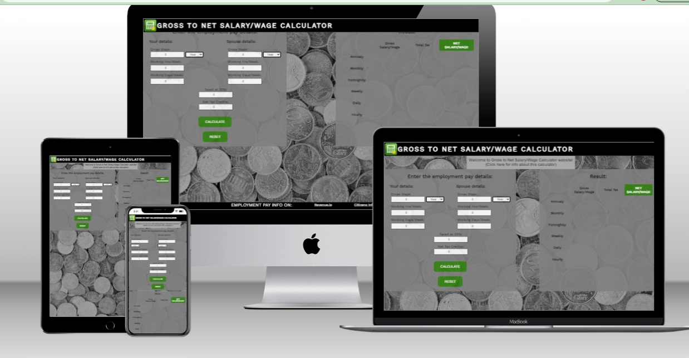

## User Experience (UX)

### Target audience

The target audience for this website are:
* Current employees in Ireland;
* Potential employees in Ireland;
* People interested to find out the difference between the gross and net salaries in Ireland.

### User stories

#### Website Owner

  
As a website Owner, I want to:

* provide the user with clear and easy to read information about the Calculator, it's advantages and limitations, so that the user could understand the precision of the results.
* provide the user with clear and easy to fill form, so that the user could understand where and what he should enter and spend less time for filling the form. 
* provide the user with clear information about what information he needs to enter in the form and where he could find that information, so that the user could spend less time to look for those.
* set the calculator with some default values, so that the user have the possibility to ignore some form fields, if he doesn't have the details.
* offer the user the possibility to select the period for which the gross salary/wage rate was entered, so that the user shouldn't convert the income rate he knows for a required period.
offer the user the possibility to reset the form, so that he shouldn't reload the page to enter new details.
* display the results for all possible pay periods (annualy, monthly, fortnightly, weekly, daily, hourly), so that the user could have a complete and detailed picture of his net salary/wage;
* display also the total tax and the gross salary/wage for each of the above mentioned periods, so that the user could a complete picture of how his income is divized. 
* offer the user the possibility to access few links, so that he could find out all the information about the employment pay, income taxes and other relevant information.

#### User expectations (First time visitor, Returning Visitor, Frequent User)

As a first time, returning or frequent visitor, I expect to:

* easily understand the main purpose of the site and some information about the calculator (can be found clicking the modal);
* easily find what information I need for filling the form (can be found clicking the modal and reading the fields description, also there is some useful information while mouse hovering some areas);
* easily and intuitively filling the form;
* easily find the result.
* easily and intuitively navigate throughout the site to find content;
* easily find and access the links for more information.
* be able to view the website and read all information on all screen sizes;
* see a visually appealing design.


## Features

### Header

* The header contains website’s Logo and Title.
* The Header has fixed position to allow users to see the website name and logo on any size device.


### Modal 

* The Modal contains a welcome heading and provides the user with information about the purpose of the website, the advantages and limitations of the calculator, informs the user what details he needs to enter in the form and where could he find them and other useful information. 
* It is easy to find and access, because of the zoom and change color effect when hover over the mouse and also it contains the advice to click it.
* The modal is responsive for any device screen.


### Employment pay details form

* Employment pay details form should be filled by the user in order to get the result expected.
* It is visualy devided into 3 sections: Your details on the left, Spouse details on the right, both of them including 3 input fields (Gross Wage, Working Hrs/Week and Working Days/Week) and a period selector. The centered section is for income tax details.
* The spouse details section is not mandatory for filling. If ignored, the net salary/wage will be returned for a single assessed person. The user is informed about that when the mouse hover over the respective area.
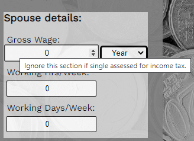
* The section for incmome tax details isn't mandatory for filling. The user is informed about that when the mouse hover over the respective area.If ignored, the calculator will use the values pre-set in formulas and:
    * the net salary/wage will be returned for a single assessed person, in that case when the user enters just his salary/wage;
    * the net salary/wage will be returned for a joint assessed couple, in that case when the user enters both salaries for him and spouse.
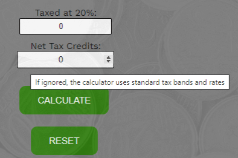
* The period selectors allows the user to use that salary/wage rate that is convenient for him, without the need to convert it for a special period.
* The buttons Calculate and Reset allows the user to get the results and, respectively, to reset the form, without reloading the page.
* The form is fully responsive on all devices.

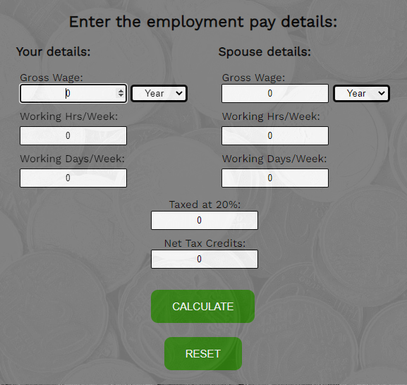

### Result section

* Result section includes a table containing the Gross Salary/Wage, Total Tax and Net Salary/Wage results for all possible pay periods, offering the user the possibility to see a complete picture of his employment pay and to analyse the information provided.
* The Net Salary/Wage result is displayed on a green background, increasing its visibility and making it easy for the user to find it.
* The table is responsible on all devices.

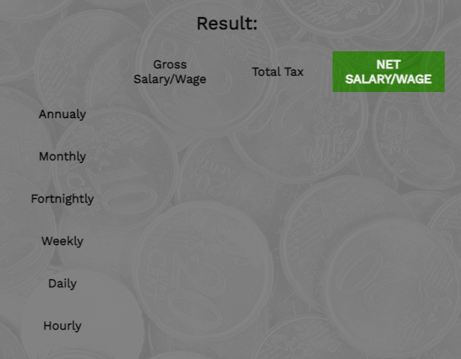

### Footer

* The footer includes links to relevant sites where the user could find all the information about employment pay in Ireland.
* The links are easily accesible.
* The footer is responsive on different devices.


### Features left to implement

* A section with grafic analitics of the employment income.
* The possibility to update the results when the one or more input fields are changed, without reseting all the information.


## Design

### Wireframes

* Website's wireframe was created in Balsamiq.
* Desktop and Mobile versions are presented below.
  
    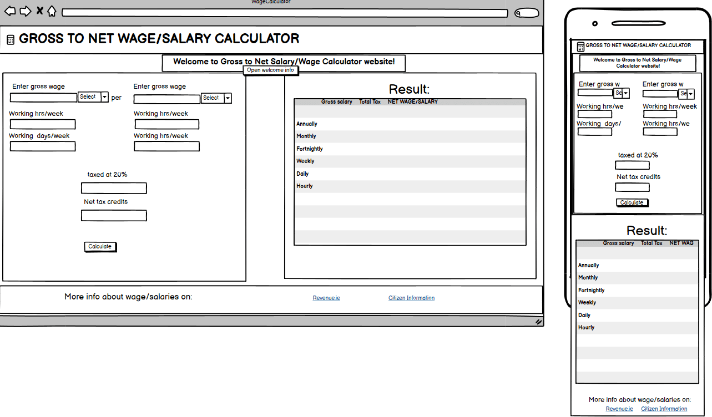
  
### Color scheme

* The color scheme for the website was selected based on the logo colors and background picture colors. 
* The nuances for the website were extracted from the background picture using Adobe Color.

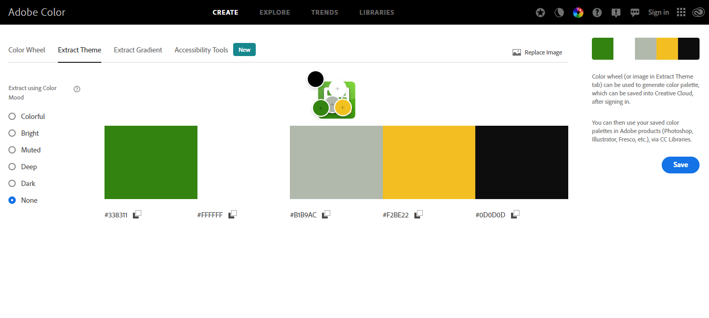


## Technologies

* HTML
    * The website's structure was developed using HTML as the main language.
* CSS
    * The website was styled using CSS.
* [GitHub](https://github.com/)
    * GitHub hosts the source code that is deployed using Git Pages.
* Git
    * Commit and pushing code, using Git while creating the website.
* [Font Awesome](https://fontawesome.com/)
    * The icons used 
* [Google Fonts](https://fonts.google.com/)
    * Used to select font families for website's body and headings.
* [Tinypng](https://tinypng.com/)
    * Used to reduce the pictures embedded on the website.
* Paint app 
    * Used to tailor the pictures embedded on the website.
* [Adobe Color](https://color.adobe.com/)
    * Used to extract the color scheme from the background picture.
* [Balsamiq](https://balsamiq.com/wireframes/)
    * Used to create the wireframes for desktop, tablet and mobile.


## Testing

### Validator Testing

* HTML 
    * [W3C Validator](https://validator.w3.org/) was used for HTML validation.
    * No errors or warnings have been found.

    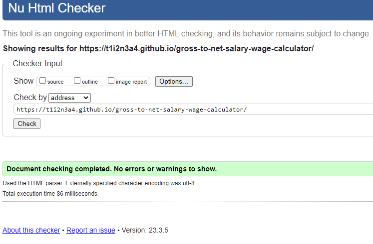

* CSS
    * [W3C CSS validator (Jigsaw)](https://jigsaw.w3.org/css-validator/) was used for CSS validation.
    * No errors have been found.

    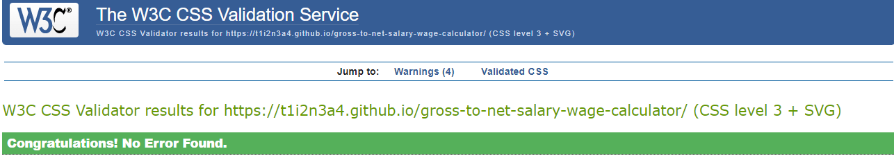

* JavaScript
    * [JSHint)](https://jshint.com/) was used for CSS validation.
    * No errors have been found.

    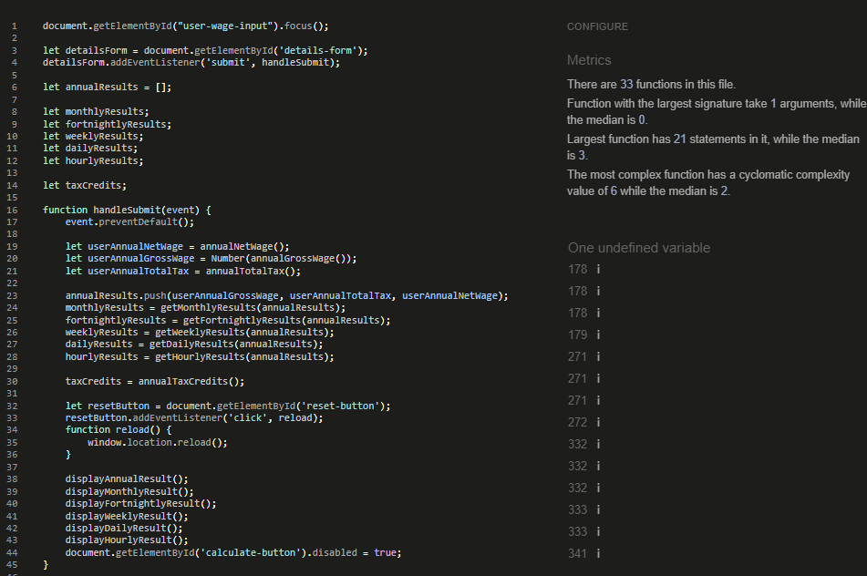

### Lighthouse Testing

* Performance, Accessibility, Best Practices and SEO for each page were tested by running them through Lighthouse in DevTools.
* The results are presented below.

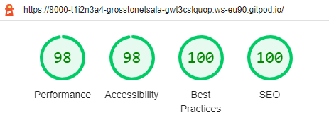

### Responsiveness

* The website is responsive on any screen sizes from 320px and upwards on Chrome, Firefox, Edge and Opera browsers.
* The responsiveness was tested using Developer Tools set to responsive and decreasing width from maximum to 320px.
* The website was opened on the following devices:
    * DESKTOP-HS5R5Q3
    * Samsung Galaxy S22
    * Iphone 12 Mini
    * MacBook Pro
* No issues have been seen.


### Accessibility

* Website's accessibility evaluation was done using [Wave Accessibility](https://wave.webaim.org/) tool.
* No errors have been found.
* Accessibility evaluation results are presented below.
    * About us page accessibility evaluation result:

    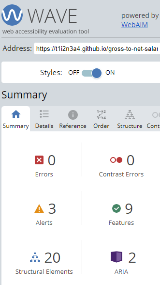


### Functional testing
    
* Websites Links

    * Clicking on the websites links in the footer box, each of the links opens the respective website.
    * As expected, each website opens in a new tab.


* Form testing

    * The Employment pay details form was tested for functionality.
    * If one of the fields is empty a warning message "Please fill this field" appears when click to submit.
    * Value 0 is set by default to ensure the correct computations when the user doesn't fill some fields.
    * If correct inputs are submitted, no warning or errors appear. 
    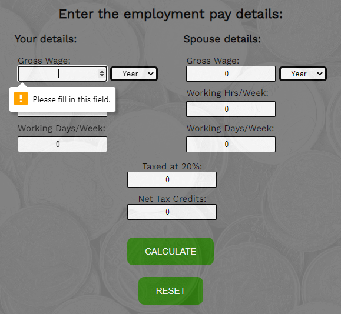

  
### Unfixed bugs

* Add formula for default calculation of net salary if the user doesn't fill the "taxed at 20%" field.


## Deployment

### Version Control

* The site was created on [Gitpod](https://www.gitpod.io/) platform.
* The code was added to the staging area using ```git add .``` command.
* Changes were committed using ```git commit -m “ ”``` command.
* Committed code was pushed to the GitHub repository using ```git push``` command.

### Deployment to Github Pages

* The website was deployed to GitHub Pages, following the steps:
    * GitHub Repository - Settings - General (left side menu) - Pages - Build a Deployment - Source - Branch: main - Save.
    * Go back to GitHub Pages were a live link is displayed when published successfully.
    * The live link can be found [here](https://t1i2n3a4.github.io/gross-to-net-salary-wage-calculator/).

### Clone the Repository Code Locally

1. Navigate to the project's repository
2. Click on the Code button
3. Copy HTTPS repository link 
4. Open Git Bash (previously installed)
5. Type git clone 
6. Press Enter

The project is cloned on my local machine.


## Credits

* Code
    * Most of the codes used throughout the project were learnt at the [Code Institute Programme](https://learn.codeinstitute.net/), including the CI projects.
    * [W3Scools](https://www.w3schools.com/) and [freeCodeCamp](https://www.freecodecamp.org/) were used to solve the issues aroused while developing the project.
    * [W3Scools](https://www.w3schools.com/) was used to create the modal. The modal is copy-paste from that website.
    * [W3Scools](https://www.w3schools.com/) was used for Button disabled Property.
    * [FreeCodeCamp](https://www.freecodecamp.org/) was used for more information about refreshing the page in Javascript.
    * 
* Content 
    * The website's content was written by the developer.
* Media
    * The logo picture for the website was taken from [PngWing](https://www.pngwing.com/):
        * "logo.png" - [Computer Icons Payroll Salary Calculator](https://www.pngwing.com/en/free-png-zqihu/download)
    * The background picture for the website was taken from [Pexels](https://www.pexels.com/):
        * "euro-coins1.png" - [Pixabay](https://www.pexels.com/photo/pile-of-gold-round-coins-106152/) .
        
        
    
## Acknowledgements
* Special thanks of gratitude to my project mentor Daisy McGirr for her guidance at every stage of the project, continuous support, understanding, encouragement and supply with useful information.
* Special thanks of gratitude to our cohort tutor Irene Neville for her continuous support, for informational material and for providing with all the facilities required during the project development.
* Special thanks of gratitude to Code Institute Tutors: Sean, Ed, Joshua, Oisin for helping me to solve some issues.
* Thank you to my family for their understanding, patience, support and encouragement.
     


